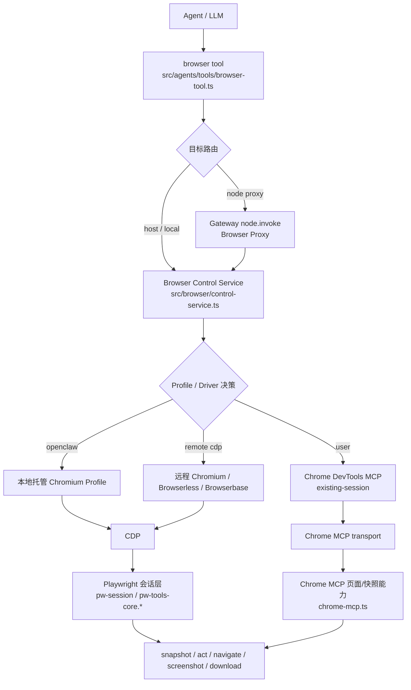
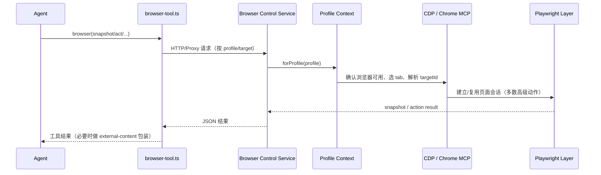

# OpenClaw 最新浏览器操控管理方案技术调研实施报告

- **调研对象**：OpenClaw 浏览器操控/管理方案（面向 Agent）
- **调研日期**：2026-03-18
- **调研基线**：GitHub `openclaw/openclaw`
- **调研提交**：`9e8b9ab`（本地拉取时 HEAD）
- **调研方式**：基于最新源码与同仓文档的静态阅读；**不编造未在源码/文档中直接体现的行为**
- **目标读者**：需要调用 OpenClaw `browser` 工具或维护相关能力的 Agent / 开发者

> **本机源码根目录**：`/Users/rensiwen/Documents/react-projects/Next-PJ/clawdbot`
>
> 本报告中所有源码路径均为相对于此根目录的相对路径。若需 Claude Code 直接读取源文件，拼接上述前缀即可。例如 `src/browser/config.ts` 的绝对路径为 `/Users/rensiwen/Documents/react-projects/Next-PJ/clawdbot/src/browser/config.ts`。

---

## 0. 执行摘要

OpenClaw 最新版本的浏览器操控方案，可以概括为：

1. **Agent 侧统一入口是 `browser` 工具**，由 `src/agents/tools/browser-tool.ts` 负责参数解析、目标路由、代理转发与结果包装。
2. **Gateway 内部存在一个 browser control service**，由 `src/browser/control-service.ts` 启动并维护，是浏览器能力的统一控制面。
3. **不同浏览器连接模式在同一抽象下统一管理**，但底层传输并不相同：
   - `openclaw` 托管浏览器：**CDP**
   - 远程浏览器 / Browserless / Browserbase：**远程 CDP / WebSocket**
   - `user`（已有 Chrome 会话）：**Chrome DevTools MCP**
4. **高级页面交互（如 snapshot / act / click / type / drag / download 等）仍然高度依赖 Playwright 会话层**，并非纯裸 CDP。
5. **多机/远程部署下，node browser proxy 已是正式路径**：Gateway 可把 browser 请求自动路由到 browser-capable node。

因此，更准确的最新表述应是：

> OpenClaw 的浏览器能力不是单一”CDP 驱动”，而是一个由 **browser tool + browser control service + 多后端传输（CDP / 远程 CDP / Chrome MCP）+ Playwright 交互层** 组成的统一浏览器控制系统。

---

## 1. 技术架构图

### 1.1 总体架构图

### 1.2 典型调用链（以 `snapshot/act` 为例）

---

## 2. 关键源码索引

以下文件是本次调研中最关键的实现入口：

### 2.1 Agent 工具层

- `src/agents/tools/browser-tool.ts`
  - browser 工具主入口
  - 负责：参数读取、`target`/`profile`/`node` 路由、node proxy 转发、文件代理
- `src/agents/tools/browser-tool.actions.ts`
  - `tabs` / `snapshot` / `console` / `act` 等工具动作封装
  - 对 browser 返回内容做 `external-content` 包装，避免将浏览器页面内容当作高可信输入
- `src/agents/tools/browser-tool.schema.ts`
  - browser 工具参数 schema

### 2.2 Browser 控制面

- `src/browser/control-service.ts`
  - 启动 browser control service
  - 从配置解析 browser profiles，并初始化运行态
- `src/browser/server-context.ts`
  - profile 维度上下文
  - 管理 profile 选择、状态查询、tab 操作、可用性检查、reset 等
- `src/browser/client.ts`
  - browser HTTP API 客户端
  - 包含 `status/start/stop/profiles/tabs/snapshot/...`
- `src/browser/client-actions-core.ts`
  - `navigate/act/dialog/upload/download` 等动作请求定义与发送

### 2.3 Browser 配置与能力判定

- `src/browser/config.ts`
  - browser 全局配置与 profile 解析
  - 自动补齐默认 `openclaw` / `user` profile
- `src/browser/profile-capabilities.ts`
  - 根据 profile 计算能力：
    - 是否是 `chrome-mcp`
    - 是否 remote
    - 是否支持 JSON tab endpoints
    - 是否支持 reset / managed tab limit

### 2.4 具体传输/执行层

- `src/browser/chrome.ts`
  - 本地托管 Chromium 启动与 CDP 健康检查
- `src/browser/chrome-mcp.ts`
  - `existing-session` / `user` 模式核心实现
  - 通过 `chrome-devtools-mcp@latest --autoConnect` 接入
- `src/browser/pw-session.ts`
  - Playwright over CDP 会话建立、缓存、targetId → Page 解析
- `src/browser/pw-tools-core.interactions.ts`
  - click/type/hover/drag/select/fill/wait/evaluate 等交互实现
- `src/browser/pw-tools-core.downloads.ts`
  - 下载相关能力

---

## 3. 浏览器操控控制面的总体设计

## 3.1 browser tool 是统一入口

源码：`src/agents/tools/browser-tool.ts`

browser 工具并不直接自己操作浏览器，而是扮演“统一调度层”角色：

- 读取 `profile` / `target` / `node`
- 判断是否要走 host、本地、sandbox 或 node proxy
- 通过 browser client 或 gateway tool 转发到底层 browser control service

这说明 **Agent 看到的是单一 browser 工具接口，底层实现可以按 profile/部署形态切换**。

---

## 3.2 browser control service 是统一控制面

源码：`src/browser/control-service.ts`

关键事实：

- Gateway 启动时会基于配置 `resolveBrowserConfig()` 初始化 browser runtime
- 若 browser 未禁用，则启动 browser control service
- service 内部维护 runtime state，并为各 profile 提供统一上下文

这意味着：

- Agent 工具层与具体浏览器驱动解耦
- 本地浏览器、远程浏览器、MCP attach 都被纳入同一服务管理

---

## 3.3 profile 是核心抽象单位

源码：`src/browser/config.ts`、`src/browser/server-context.ts`

OpenClaw 以 **profile** 作为浏览器控制的核心路由对象。

每个 profile 的类型定义为 `ResolvedBrowserProfile`（`config.ts:42-52`），包含以下属性：

- `name: string`
- `cdpPort: number`
- `cdpUrl: string`
- `cdpHost: string`
- `cdpIsLoopback: boolean`
- `userDataDir?: string`（可选）
- `color: string`
- `driver: "openclaw" | "existing-session"`
- `attachOnly: boolean`

已知 driver（按源码 `config.ts:50` 类型定义）：

- `openclaw`
- `existing-session`

远程浏览器（remote CDP）不是通过扩展 `driver` 值来实现的，而是通过 `cdpUrl` 指向非 loopback 地址来触发 `remote-cdp` 能力模式（见 `profile-capabilities.ts:33` 的 `cdpIsLoopback` 判定）。

---

## 4. 连接模式设计

这是本报告的重点部分。

### 4.1 模式一：`openclaw` 托管浏览器（本地 managed profile）

**适用目标**：

- 需要隔离浏览器环境
- 不希望污染用户真实 Chrome profile
- 需要确定性较强的 Agent 自动化

**核心源码**：

- `src/browser/chrome.ts`
- `src/browser/config.ts`
- `src/browser/profile-capabilities.ts`

**实现事实**：

1. OpenClaw 会为 profile 分配独立的 `cdpPort`
2. 启动 Chromium 类浏览器时，会传入：
   - `--remote-debugging-port=<cdpPort>`
   - `--user-data-dir=<独立目录>`
3. 会创建/装饰独立 profile（含颜色标识）
4. 通过 CDP 检查浏览器是否可达

`src/browser/chrome.ts` 中可直接看到：

- `--remote-debugging-port=${profile.cdpPort}`
- `--user-data-dir=${userDataDir}`
- 启动后轮询 `isChromeReachable(profile.cdpUrl)`

**能力特点**（见 `profile-capabilities.ts`）：

- `mode: "local-managed"`
- `usesChromeMcp: false`
- `supportsPerTabWs: true`
- `supportsJsonTabEndpoints: true`
- `supportsReset: true`
- `supportsManagedTabLimit: true`

**解释**：

这是 OpenClaw 最“原生”的浏览器模式，控制力最完整，也最符合 Agent 自动化场景。

---

### 4.2 模式二：远程 CDP / 远程 WebSocket

**适用目标**：

- Gateway 不在浏览器所在机器
- 使用 Browserless / Browserbase / 其他远程 Chromium 提供商
- 需要跨机器/云端复用浏览器

**核心源码**：

- `src/browser/config.ts`
- `src/browser/chrome.ts`
- `src/browser/pw-session.ts`
- 文档：`docs/tools/browser.md`

**实现事实**：

1. profile 可配置 `cdpUrl`
2. `parseHttpUrl()` 允许：
   - `http:`
   - `https:`
   - `ws:`
   - `wss:`
3. `chrome.ts` 中：
   - HTTP(S) 场景会请求 `/json/version` 之类的 CDP 发现端点
   - WebSocket 场景可直接作为 CDP WebSocket endpoint 使用
4. `pw-session.ts` 会优先尝试解析 WS URL，再通过 `chromium.connectOverCDP()` 建立 Playwright 连接

**能力特点**（见 `profile-capabilities.ts`）：

- `mode: "remote-cdp"`
- `isRemote: true`
- `usesChromeMcp: false`
- `usesPersistentPlaywright: true`

**解释**：

远程浏览器不是“特殊工具”，而是被纳入同一个 browser profile 体系。只要 `cdpUrl` 可达，就能进入统一的 snapshot / act / screenshot 流程。

---

### 4.3 模式三：`user` / existing-session（Chrome DevTools MCP）

**适用目标**：

- 需要复用用户已有登录态
- 要在用户真实 Chrome 会话里操作已有标签页
- 用户在场，能批准 attach/连接流程

**核心源码**：

- `src/browser/chrome-mcp.ts`
- `src/browser/config.ts`
- `src/browser/profile-capabilities.ts`
- `src/browser/server-context.ts`

**这是最新版本最重要的升级点之一。**

#### 关键事实 A：`user` profile 会被自动补齐

在 `config.ts` 中：

- 若 profile 列表里没有 `user`
- 会自动创建：
  - `driver: "existing-session"`
  - `attachOnly: true`
  - `color: "#00AA00"`

#### 关键事实 B：existing-session 明确走 Chrome MCP

`chrome-mcp.ts` 中默认命令直接写死为：

- `npx`
- `chrome-devtools-mcp@latest`
- `--autoConnect`
- `--experimentalStructuredContent`
- `--experimental-page-id-routing`

这说明 **最新实现并不是旧式 remote-debugging-port 直连思路，而是基于官方 Chrome DevTools MCP**。

#### 关键事实 C：能力层显式标记为 `usesChromeMcp`

`profile-capabilities.ts`：

- `mode: "local-existing-session"`
- `usesChromeMcp: true`
- `supportsJsonTabEndpoints: false`
- `supportsReset: false`

这意味着：

- `user` 模式和本地托管浏览器在控制语义上被统一
- 但其底层 transport 与部分能力边界不同

#### 关键事实 D：状态接口会显示 `transport: "chrome-mcp"`

`server-context.ts` 中，profile 状态返回：

- `transport: capabilities.usesChromeMcp ? "chrome-mcp" : "cdp"`

也就是说，**OpenClaw 自己内部已经明确把 MCP 作为独立 transport 类型看待**。

---

### 4.4 历史说明：`chrome-relay` 已从内建 profile 中移除

早期版本中 `chrome-relay` 曾作为自动创建的内建 profile 存在，用于通过 Chrome 扩展 relay 接入已有标签页。

**当前状态**（基于源码验证）：

- `config.test.ts` 明确注释：`// chrome-relay is no longer auto-created`
- 测试断言：`resolveProfile(resolved, “chrome-relay”)` 返回 `null`
- CHANGELOG 记载：`drop the auto-created chrome-relay browser profile; users who need the Chrome extension relay must now create their own profile via openclaw browser create-profile`
- `docs/tools/browser.md` 中不再包含 `chrome-relay` 或 `relay` 的任何提及

因此，**`chrome-relay` 不再是内建连接模式**。需要扩展 relay 功能的用户须通过 `openclaw browser create-profile` 手动创建自定义 profile。

---

## 5. Playwright 在最新架构里的角色

如果只说“OpenClaw 用 CDP 控浏览器”，是不准确的。

### 5.1 Playwright 不是可有可无的附件，而是高级交互层

关键源码：

- `src/browser/pw-session.ts`
- `src/browser/pw-tools-core.interactions.ts`
- `src/browser/pw-tools-core.downloads.ts`

#### 已确认事实

1. `pw-session.ts` 使用：
   - `chromium.connectOverCDP()`
2. 会缓存基于 `cdpUrl` 的已连接 Browser
3. 会将 `targetId` 解析到具体 `Page`
4. 页面级 ref、role ref、locator 与交互逻辑都在 Playwright 语义上实现

例如：

- `connectBrowser(cdpUrl)`：建立/缓存 Playwright Browser
- `getPageForTargetId()`：根据 `targetId` 找 Page
- `refLocator(page, ref)`：把 snapshot 里的 ref 解析到页面元素

### 5.2 为什么这很重要

这意味着：

- snapshot / click / type / drag / select / wait / evaluate 等高级动作，**通常不是直接裸 CDP 命令**
- OpenClaw 是把 CDP 当底层 transport，再通过 Playwright 提供稳定的人机交互抽象

这也解释了文档里反复提到：

- 没装 Playwright 时，一部分能力会退化或返回 501

---

## 6. snapshot / act 的真实调用思路

下面给出基于最新源码的实事求是总结。

### 6.1 `snapshot`

入口：`src/agents/tools/browser-tool.actions.ts`

流程上：

1. browser tool 读取：
   - `snapshotFormat`
   - `mode`
   - `refs`
   - `targetId`
   - `interactive` / `compact` / `depth` / `selector` / `frame`
2. 调 `browserSnapshot()`（本地）或 proxyRequest → `/snapshot`（node）
3. 返回：
   - `format: "ai"` 或 `"aria"`
   - `targetId`
   - `url`
   - snapshot 文本 / ARIA nodes
4. 若是 AI snapshot，还会对页面内容做 `external-content` 包装

这说明 OpenClaw **明确把浏览器页面内容当作外部不可信内容处理**，这是面向 Agent 的重要安全语义。

---

### 6.2 `act`

入口：

- `src/agents/tools/browser-tool.ts`
- `src/browser/client-actions-core.ts`
- `src/browser/pw-tools-core.interactions.ts`

`client-actions-core.ts` 定义了 `BrowserActRequest`，可见支持：

- `click`
- `type`
- `press`
- `hover`
- `scrollIntoView`
- `drag`
- `select`
- `fill`
- `resize`
- `wait`
- `evaluate`
- `close`
- `batch`

这些请求最终发到 `/act`，然后由底层页面执行层完成。

### 6.3 `targetId` 是 tab 级路由关键字

`pw-session.ts` 显示：

- 会尝试通过 page-scoped CDP 或 `/json/list` 将 `targetId` 对应到具体 `Page`
- 若解析失败，在某些退化条件下会用单页 fallback

这说明 OpenClaw 的页面控制不是简单“对当前最后一个 tab 操作”，而是尽量依赖 **确定性的 targetId 映射**。

---

## 7. Node Browser Proxy：最新架构的重要补充

### 7.1 browser 请求不一定落在本机

`browser-tool.ts` 中可见：

- `resolveBrowserNodeTarget()`
- `callBrowserProxy()`

逻辑表明：

- Gateway 可发现 browser-capable node
- 在 `target=node`、显式指定 node、或 auto policy 命中时
- browser 请求会通过 gateway 的 node invoke 转发到节点侧浏览器控制服务

### 7.2 这对部署设计的含义

最新版 OpenClaw 已经不是“浏览器必须和 Gateway 同机”的设计。

更准确地说：

- **控制面**可以在 Gateway
- **浏览器执行面**可以在 node
- Agent 仍然只看到一个统一 browser tool

这对分布式/家庭节点/远程桌面场景非常关键。

---

## 8. 配置设计要点

基于 `config.ts` 与文档，可确认以下配置原则：

### 8.1 默认 profile 自动补齐

- 默认 `openclaw` profile 会自动补齐
- 默认 `user` profile 也会自动补齐

### 8.2 `cdpUrl` 支持多协议

`parseHttpUrl()` 明确接受：

- `http`
- `https`
- `ws`
- `wss`

说明远程浏览器服务不局限于 HTTP 发现端点。

### 8.3 SSRF 策略是 browser 配置的一部分

`config.ts` 中有 `resolveBrowserSsrFPolicy()`，说明：

- browser 导航与远程 CDP 可达性检查会受 SSRF policy 影响
- 严格模式下，私网访问会受限

### 8.4 本地 managed profile 使用独立 user data dir

`chrome.ts` 中：

- `resolveOpenClawUserDataDir(profile.name)`
- 启动参数强制指定 `--user-data-dir`

这保证了与用户真实浏览器环境隔离。

---

## 9. 关键源码片段（按语义摘录）

> 以下为“语义级关键点”，不是逐字全文搬运。

### 9.1 browser control service 启动

文件：`src/browser/control-service.ts`

- `resolveBrowserConfig(cfg.browser, cfg)`
- 若 `resolved.enabled` 为真，则创建 browser runtime state
- 日志：`Browser control service ready`

**结论**：browser control service 是 Gateway 级子系统。

### 9.2 `user` profile 自动创建为 existing-session

文件：`src/browser/config.ts`

- 若没有 `user` profile，则自动创建：
  - `driver: "existing-session"`
  - `attachOnly: true`

**结论**：`user` 不是文档层面的概念，而是源码层面的内建默认 profile。

### 9.3 existing-session 使用 Chrome MCP

文件：`src/browser/chrome-mcp.ts`

- 默认命令：`npx chrome-devtools-mcp@latest --autoConnect ...`

**结论**：最新版本下，已有 Chrome 会话接入方案明确基于 Chrome DevTools MCP。

### 9.4 本地 managed 浏览器启动参数

文件：`src/browser/chrome.ts`

- `--remote-debugging-port=<cdpPort>`
- `--user-data-dir=<dir>`
- 启动后调用 `isChromeReachable(profile.cdpUrl)` 检查

**结论**：本地托管模式仍然以 CDP 为底层接入协议。

### 9.5 Playwright over CDP

文件：`src/browser/pw-session.ts`

- `chromium.connectOverCDP(endpoint, { timeout, headers })`

**结论**：高级交互层通过 Playwright 建立在 CDP 之上。

### 9.6 Profile transport 暴露为 `cdp` 或 `chrome-mcp`

文件：`src/browser/server-context.ts`

- `transport: capabilities.usesChromeMcp ? "chrome-mcp" : "cdp"`

**结论**：OpenClaw 内部显式区分两种 transport。

---

## 10. 对 Agent 的实施建议

以下建议基于当前源码逻辑，而非主观偏好。

### 10.1 选择 profile 的推荐原则

#### 优先 `openclaw`
适合：
- 自动化执行
- 无需复用登录态
- 追求隔离性与确定性

#### 需要真实登录态时用 `user`
适合：
- 已登录站点
- 用户就在电脑前
- 可以接受 attach 风险与交互要求

注意：
- `user` 不是最安全模式
- 它进入的是用户已有 Chrome 会话

#### 跨机器部署时优先考虑 node browser proxy
适合：
- Gateway 与浏览器不在同机
- 浏览器运行在远程 node/桌面机/家里电脑

---

### 10.2 Agent 在执行 browser 操作时的工作流建议

建议流程：

1. 先 `status` / `profiles` / `tabs`
2. 明确当前 `profile` 和 `targetId`
3. 对页面交互先 `snapshot`
4. 再 `act(click/type/...)`
5. 导航后重新 snapshot，避免使用旧 ref

原因：

- `targetId` 与 ref 都是当前页面状态相关的
- snapshot 是 Agent 稳定决策的基础

---

### 10.3 对工具编排器的建议

如果你在写上层 Agent 编排逻辑：

- 不要假设所有 profile 都支持相同 transport
- 不要把 `user` 当成“另一个 CDP 端口”
- 对 `existing-session` 需要意识到它是 **Chrome MCP transport**
- 对 remote profile 要预留网络超时与握手失败处理
- 对页面内容输入，应继承 browser tool 的“不可信外部内容”语义

---

## 11. 风险与边界

### 11.1 本报告确认过的事实

以下结论已从源码直接验证：

- browser tool 是统一入口
- browser control service 是统一控制面
- `user` profile 自动创建为 `existing-session`
- `existing-session` 使用 Chrome DevTools MCP
- local managed profile 走 CDP
- remote `cdpUrl` 支持 HTTP/HTTPS/WS/WSS
- Playwright 是高级交互层核心
- node browser proxy 是正式路径

### 11.2 本报告谨慎表述的部分

以下内容虽然有充分迹象，但本次未穷尽所有实现细节，因此仅做保守表述：

- 某些具体截图/PDF/download 分支在不同 profile 模式下的所有差异
- 所有 fallback 行为的完整矩阵

---

## 12. 最终结论

站在 2026-03-18 最新源码的角度，OpenClaw 的浏览器操控管理方案可以下如下定义：

> 它是一个以 **browser tool** 为统一入口、由 **browser control service** 统一调度、以 **profile** 为核心抽象、同时支持 **本地托管 CDP、远程 CDP/WebSocket、Chrome DevTools MCP existing-session** 三种内建连接模式的浏览器控制系统；其中高级页面交互主要依赖 **Playwright over CDP** 或相应 transport 的页面抽象完成。

如果要给 Agent 一句最实用的话：

> **默认用 `openclaw`；需要登录态用 `user`；跨机器则优先考虑 node browser proxy。**

---

## 13. 附录：建议继续深挖的文件

若后续要把这份报告升级为“实现级设计文档”，建议继续精读：

- `src/browser/server.ts` / browser 路由注册入口（若需完整 HTTP 路由图）
- `src/browser/pw-tools-core.interactions.ts`
- `src/browser/screenshot.ts`（截图核心实现）
- `src/browser/pw-tools-core.downloads.ts`
- `src/browser/server-context.selection.ts`
- `src/browser/server-context.tab-ops.ts`
- `src/browser/server-context.availability.ts`
- `src/browser/chrome-mcp.snapshot.ts`
- `docs/tools/browser.md`
- `docs/tools/browser-login.md`
- `docs/tools/browser-wsl2-windows-remote-cdp-troubleshooting.md`

---

## 14. 本报告使用的主要证据文件

- `src/agents/tools/browser-tool.ts`
- `src/agents/tools/browser-tool.actions.ts`
- `src/browser/control-service.ts`
- `src/browser/config.ts`
- `src/browser/profile-capabilities.ts`
- `src/browser/client.ts`
- `src/browser/client-actions-core.ts`
- `src/browser/server-context.ts`
- `src/browser/chrome.ts`
- `src/browser/chrome-mcp.ts`
- `src/browser/pw-session.ts`
- `docs/tools/browser.md`

---

如需继续完善，可在此报告基础上追加：

- 路由级 HTTP API 一览表
- `snapshot/act` 逐文件调用链图
- profile 能力矩阵表
- MCP / remote CDP 差异对照表
