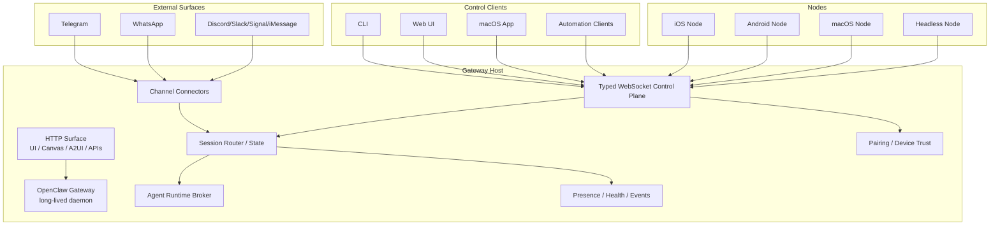
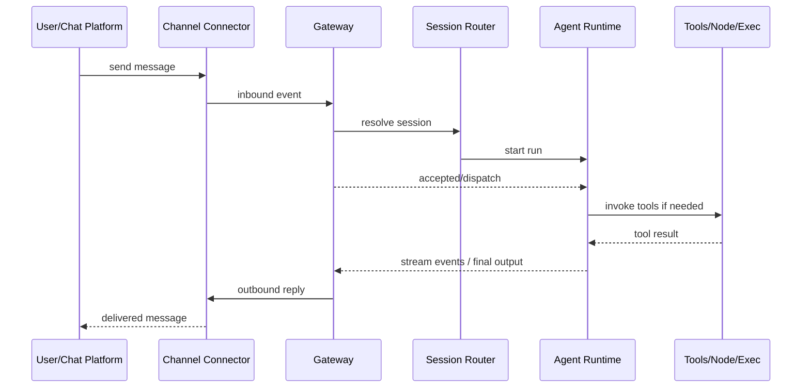
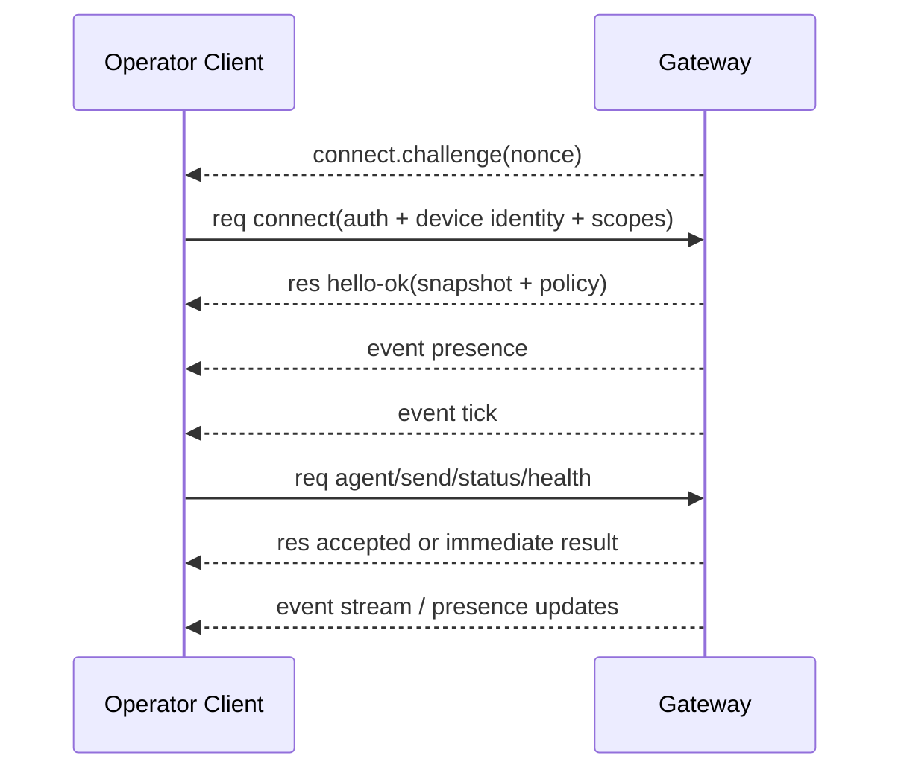

# OpenClaw Gateway 实现原理调研

> 本文聚焦 OpenClaw Gateway 的**设计定位、内部机制、协议模型、架构分层与关键链路**。

---

# 1. Gateway 在 OpenClaw 里的本质定位

如果把 OpenClaw 看成一个完整系统，那 **Gateway 不是“某个 bot 命令”**，也不是“某个 agent 的外壳”。

它本质上是 OpenClaw 的：

- **常驻宿主进程**
- **统一控制平面（control plane）**
- **消息与设备接入枢纽**
- **Agent / Channel / Node / UI 的编排中心**

一句话概括：

> **Gateway = OpenClaw 的控制中枢；Agent 只是被它调度的一类运行能力。**

这也是为什么官方文档反复强调：

- 一个 host 通常只跑一个 Gateway
- 所有 client / node 都往同一个 WS 控制面接
- 所有消息渠道连接都由 Gateway 持有

所以它更像：

- Kubernetes 里的 control plane
- IM 系统里的接入网关 + 会话总线
- Agent 系统里的 runtime broker

而不是“一个会回复消息的脚本”。

---

# 2. 为什么 OpenClaw 需要 Gateway

如果没有 Gateway，OpenClaw 会退化成很多彼此割裂的组件：

- Telegram/WhatsApp 各自维护连接
- CLI 自己想办法调 Agent
- Web UI 自己想办法拿状态
- iOS / Android / macOS 节点自己找目标进程
- Canvas / browser / tools 入口彼此分散

这样会有几个根本问题：

## 2.1 连接所有权混乱

像 WhatsApp 这类连接，天然不适合多个进程同时持有。  
所以必须有一个**唯一 owner**。

Gateway 就承担这个 owner 角色。

## 2.2 状态无法集中

系统里真正需要被统一维护的，不只是“消息”，还有：

- 会话状态
- presence
- pairing 状态
- health 状态
- node 能力声明
- agent 运行事件
- 审批/授权事件

这些状态如果散在多个进程里，会让系统很快失控。

## 2.3 UI / 自动化 / 节点缺少统一入口

OpenClaw 不是只有一个 bot。它还有：

- CLI
- Web 控制界面
- macOS app
- iOS / Android 节点
- headless node
- 自动化客户端

这些都需要一个统一入口。Gateway 就是那个入口。

---

# 3. Gateway 的核心设计思想

我把它总结成 4 个关键词：

## 3.1 单一常驻进程

Gateway 是一个 **single long-lived process**。

它不是“有消息时临时起来一下”，而是始终活着，负责：

- 持有外部渠道连接
- 接受内部控制连接
- 发出事件
- 维护状态快照
- 作为其他组件的编排宿主

这决定了它天然更偏“系统服务”，而不是“脚本工具”。

## 3.2 WebSocket 统一控制面

OpenClaw 选择 **WebSocket** 作为统一控制协议，而不是把所有能力都做成零散 HTTP 接口。

原因很明显：

- 需要实时 server-push event
- 需要 presence / heartbeat
- 需要 agent streaming
- 需要 node 长连接
- 需要双向通信

所以它的中心不是 REST，而是 **typed WebSocket protocol**。

## 3.3 角色统一接入：operator / node

Gateway 没把“操作员客户端”和“节点设备”拆成两套完全不同协议，而是放进同一个 WS 协议里，用角色区分：

- `operator`
- `node`

这意味着：

- CLI / Web UI / macOS app 本质上都是 operator client
- iOS / Android / macOS 设备能力宿主本质上是 node client

统一协议，降低系统复杂度。

## 3.4 事件驱动，而不是纯请求式

虽然协议有 req/res，但 Gateway 的真正力量来自 **event stream**。

它持续往外发：

- `presence`
- `agent`
- `tick`
- `shutdown`
- 以及各种运行时事件

所以 Gateway 不是“被调用一次返回一次”的 API 服务，而是一个**持续流动的事件枢纽**。

---

# 4. 总体架构图

下面这个图是我按文档机制整理出的抽象架构：



这个图里最关键的一点是：

> **外部世界并不是直接接 Agent，而是统一先接 Gateway。**

---

# 5. 分层理解：Gateway 到底由哪些逻辑层组成

从实现原理上，可以把 Gateway 拆成 6 层。

## 5.1 接入层（Ingress Layer）

负责把各种外部输入接进系统。

包括：

- Telegram / WhatsApp / Slack / Discord 等消息渠道
- WebSocket operator client
- WebSocket node client
- HTTP 请求入口

这一层的作用不是做复杂业务，而是：

- 接住连接
- 标准化输入
- 交给内部控制逻辑

## 5.2 协议层（Protocol Layer）

这是 Gateway 的关键层。

它定义了统一 WS 消息格式：

- Request
- Response
- Event

并要求第一帧必须是 `connect`。

核心价值：

- 统一 operator / node 接入协议
- 强制握手与认证
- 用 schema 做帧校验
- 降低客户端实现分歧

## 5.3 身份与信任层（Identity / Trust Layer）

这一层处理：

- gateway auth token/password
- device identity
- device token
- pairing approval
- local auto-trust
- role / scopes

这说明 Gateway 的安全模型不是“连上就算了”，而是把**连接身份**视为一等公民。

## 5.4 状态与路由层（State / Routing Layer）

这一层负责：

- session 路由
- presence 聚合
- health 快照
- chat / agent 事件分发
- idempotency 去重

它是“系统状态真正被维护”的地方。

## 5.5 调度层（Broker / Orchestration Layer）

这里才是 Gateway 最像“控制平面”的地方。

它负责编排：

- agent run
- send
- node.invoke
- exec approval
- pairing lifecycle

也就是说，它并不一定自己完成所有事情，但它决定：

- 谁来做
- 何时做
- 如何回传结果

## 5.6 表面层（Surface Layer）

这是对外暴露的各种“表面”：

- WS control plane
- HTTP control UI
- canvas host
- A2UI host
- OpenAI 风格 HTTP API
- tools invoke HTTP API

这些表面都不是独立系统，而是 Gateway 统一对外的不同入口。

---

# 6. 进程模型：为什么它一定要是常驻 daemon

## 6.1 渠道连接要求长期持有

消息渠道连接不是无状态函数调用。  
Telegram、WhatsApp、各种 bot provider 都涉及：

- 长连接
- 认证状态
- reconnect
- inbound event

所以一个“来消息才启动进程”的模型不适合。

## 6.2 节点连接也是长连接

Node 不是一次性 RPC worker，而是长期在线设备。  
它需要持续上报：

- presence
- caps
- commands
- permissions

这天然要求 Gateway 是常驻中心。

## 6.3 Agent streaming 需要稳定宿主

Agent 请求并不总是瞬时完成。  
很多运行会经历：

- accepted
- streaming events
- final result

这更像 job orchestration，而不是同步 HTTP handler。

## 6.4 这也是它被 launchd/systemd 托管的根因

因为 Gateway 本质就是系统服务。  
用 supervisor 托管它不是“方便一点”，而是和它的架构定位一致。

---

# 7. 协议模型：Gateway 为什么选 WS，而不是全 HTTP

## 7.1 它要承载的不只是 request/response

如果系统只有：

- 发一条消息
- 查个状态

HTTP 就够了。

但 Gateway 还要承载：

- connect challenge
- pairing 交互
- presence 推送
- tick 心跳
- agent streaming
- shutdown 通知
- exec approval 广播

这些都更适合 WS。

## 7.2 它需要同一条连接上完成完整生命周期

一个典型 operator 连接的生命周期大致是：

1. 收到 challenge
2. 发 connect
3. 收到 hello + snapshot
4. 持续收到 presence / tick
5. 发起 agent 请求
6. 收到 accepted
7. 收到 streaming event
8. 收到 final result

这在 HTTP 下会很别扭，在 WS 下则非常自然。

---

# 8. Gateway 协议的核心结构

## 8.1 第一帧必须 connect

这是协议里非常硬的规则：

> **首帧必须是 connect request。**

这意味着 Gateway 从连接一开始就要求：

- 身份声明
- 协议版本协商
- 角色声明
- 认证材料
- 设备身份

也就是说，OpenClaw 没把“认证”做成连接后补充动作，而是把它放进握手本身。

## 8.2 三类基础帧

协议基础帧只有三类：

### Request
```json
{ "type": "req", "id": "...", "method": "...", "params": {} }
```

### Response
```json
{ "type": "res", "id": "...", "ok": true, "payload": {} }
```

### Event
```json
{ "type": "event", "event": "...", "payload": {} }
```

这个设计很干净。

它意味着整个系统虽然能力很多，但**通信语义被压缩成了很小的一组原语**。

## 8.3 双阶段 agent 响应

`agent` 调用不是一次 response 完事，而是：

1. 先回 `accepted`
2. 中间通过 `event:agent` 流式输出
3. 最后再给 final response

这其实是在 WS req/res 上叠了一层 job 模型。

换句话说：

> **Gateway 把 agent 调用抽象成“受控异步任务”，而不是普通同步函数。**

---

# 9. operator 与 node 为什么共用一套协议

这是我觉得 OpenClaw 设计里非常漂亮的一点。

很多系统会把：

- 控制客户端协议
- 设备节点协议

拆成两套。

OpenClaw 没这么干，而是统一成一个 WS protocol，只在 connect 时声明：

- `role: operator`
- `role: node`

这样做的好处是：

## 9.1 协议栈只有一份

- 一份握手
- 一份认证逻辑
- 一份帧模型
- 一份事件总线
- 一份 presence 体系

## 9.2 operator / node 都成为“受控参与者”

无论是 CLI，还是 iOS 节点，在 Gateway 看来，本质上都是：

- 一个带身份的连接
- 声明自己的角色、能力、范围
- 通过统一协议参与系统

## 9.3 UI 能天然看到统一 presence

文档提到 presence 可以按 device identity 聚合。  
这意味着 UI 可以把“同一设备作为 operator + node 的连接”显示为统一实体。

这就是统一协议带来的系统一致性。

---

# 10. 握手机制：为什么比普通 token auth 更复杂

Gateway 的 connect 机制不是简单地“带个 token 就行”。

它有几层。

## 10.1 challenge-first

服务端先发：

- `connect.challenge`
- 包含 nonce 与时间戳

客户端必须基于这个 nonce 去签名。

这说明 Gateway 做的不是静态凭据校验，而是**带挑战的设备证明**。

## 10.2 device identity 是强制一等公民

connect 里要求 device 信息，包括：

- `device.id`
- `publicKey`
- `signature`
- `signedAt`
- `nonce`

这意味着系统信任的不是“这个 socket”，而是“这个设备身份”。

## 10.3 gateway auth 和 device auth 是两层门

- 第一层：gateway token/password
- 第二层：device identity + pairing/device token

所以不是有 token 就万事大吉。  
OpenClaw 把“能访问网关”和“这个设备是否被信任”拆成了两层。

## 10.4 local auto-approval 是 UX 与安全之间的折中

文档说 local 连接可自动批准。  
这个 local 包括：

- loopback
- gateway host 自己的 tailnet 地址

这是一个很典型的工程折中：

- 如果连本机都每次手动配对，体验太差
- 如果所有连接都自动信任，安全太差

所以 OpenClaw 选了“本地自动，远端审批”的中间路线。

---

# 11. scopes / caps / commands / permissions 这四层声明的意义

这是协议设计里另一个重要点。

## 11.1 operator 用 scopes

operator client 通过 scopes 表示自己允许访问什么控制能力，比如：

- `operator.read`
- `operator.write`
- `operator.admin`
- `operator.approvals`
- `operator.pairing`

这是一种**控制平面权限模型**。

## 11.2 node 用 caps / commands / permissions

node 侧不是简单说“我是手机”，而是声明：

- `caps`：能力类别
- `commands`：可调用命令白名单
- `permissions`：更细粒度许可

例如：

- 我有 camera / canvas / screen / location 能力
- 我允许 `camera.snap`
- 但不允许 `screen.record`

这说明 Gateway 不是盲信 node，而是把 node 的能力视为**claim**，再由服务端做约束。

## 11.3 这本质上是“声明式能力协商”

也就是说，连接建立时，双方就已经在协商：

- 你是谁
- 你能做什么
- 我允许你做什么

这比“先连上再临时判断”更稳。

---

# 12. Presence 不是附属功能，而是系统基础设施

很多人会把 presence 理解成 UI 小功能。  
但在 OpenClaw 里，它其实是很核心的系统状态层。

因为 Gateway 需要长期知道：

- 哪些 operator 在线
- 哪些 node 在线
- 它们的 device identity 是谁
- 上次活动时间
- 它们的 role / scopes / caps 是什么

Presence 的价值不只是“显示在线”，而是让系统具备：

- 控制面可观测性
- 设备级状态统一视图
- node 可调度性
- 客户端断线恢复判断依据

所以 presence 更像“实时目录服务”，不是“聊天状态图标”。

---

# 13. Session / Agent / Channel / Node 的关系

这是理解 Gateway 的关键模型。

## 13.1 Channel 是外部消息来源

例如：

- Telegram
- WhatsApp
- Slack

它们负责把外部消息送进 Gateway。

## 13.2 Session 是上下文路由单元

消息进来后，不是直接丢给 Agent，而是先落到某个 session。

也就是说：

> **Session 是 Gateway 内部真正承接上下文的单位。**

## 13.3 Agent 是处理引擎

当某个 session 需要智能处理时，Gateway 再调度 agent run。

所以 Agent 更像：

- 一个运行时引擎
- 一个被 Gateway 触发的处理者

而不是系统总入口。

## 13.4 Node 是外部能力宿主

Node 提供的是远端能力，例如：

- camera
- canvas
- screen
- location
- system.run

Node 不是 Agent，也不是 Channel。  
它是一个被 Gateway 纳入统一协议管理的**设备执行体**。

## 13.5 Gateway 把四者编排起来

最终关系就是：

- Channel 提供输入
- Session 承接上下文
- Agent 负责智能处理
- Node 提供外部能力
- Gateway 负责编排它们

---

# 14. 关键消息链路时序图：用户消息如何流经 Gateway



这条链路说明一个核心事实：

> **Gateway 不是消息透传器，而是“消息进入系统后的总调度器”。**

---

# 15. 关键控制链路时序图：operator client 接入 Gateway



这里最重要的是 `hello-ok(snapshot)`。

这意味着客户端一连上来，不需要额外打很多请求，就已经拿到：

- 当前 presence
- health
- stateVersion
- uptime 等快照

这是一种典型的“连接即拿系统快照”的控制面设计。

---

# 16. Node 模型：OpenClaw 为什么把设备做成“能力声明节点”

OpenClaw 里的 node 不是“远程 shell”那么简单。

它本质上是一个**声明式能力宿主**。

Node 在 connect 时会声明：

- 自己是什么设备
- 具备哪些高层能力（caps）
- 暴露哪些命令（commands）
- 哪些权限开关为 true/false（permissions）

这样 Gateway 才能做三件事：

## 16.1 发现
知道系统里当前有哪些设备、各自有啥能力。

## 16.2 调度
通过 `node.invoke` 把操作定向到具体节点。

## 16.3 约束
即便节点声称“我会这个”，Gateway 也还能基于服务端策略限制调用。

这使 node 模型更接近：

- 受控 capability host
- 而不是裸远控 agent

---

# 17. 为什么说 Gateway 是“控制平面”，不是“业务逻辑进程”

因为它最核心的责任不是实现某个具体业务，而是：

- 管连接
- 管身份
- 管协议
- 管状态
- 管编排
- 管事件

这几个职责都属于 control plane 特征。

如果它是业务进程，它的重心应该是：

- 如何回答问题
- 如何生成文本
- 如何处理某类垂直业务

但 Gateway 的重心明显不是这些。

所以从系统角色上，它更像：

- runtime broker
- connection owner
- orchestration hub
- stateful control plane

---

# 18. HTTP 在 Gateway 里的角色

虽然 Gateway 的核心是 WS，但 HTTP 不是可有可无。

HTTP 在架构里更像“辅助表面层”，主要承担：

- Control UI 页面承载
- Canvas / A2UI 内容承载
- OpenAI 风格兼容 API
- tools invoke API
- hooks

也就是说：

- **WS 是实时控制总线**
- **HTTP 是各种外部表面和兼容入口**

这是一种很合理的组合：

- 实时、双向、状态性 → WS
- 页面、静态资源、兼容接口 → HTTP

---

# 19. 配置热重载与进程内重启机制的设计含义

文档里提到 Gateway 支持：

- 监视配置变化
- 对安全变更热应用
- 对关键变更触发重启
- 通过 SIGUSR1 触发进程内重启

这背后说明几个设计取向：

## 19.1 Gateway 被设计成“可长期运行且可演化”的宿主

不是改个配置就只能全靠外部人手停掉再拉起。

## 19.2 配置变更被区分为“热应用”与“需重启”

这反映了系统内部已经区分：

- 哪些状态能在线切换
- 哪些状态涉及底层连接或关键初始化，必须重建

## 19.3 重启被纳入协议与系统事件语义

因为 Gateway 有 `shutdown` 事件，客户端还知道 `restartExpectedMs`。  
说明重启不是“粗暴断开”，而是被当成受控生命周期的一部分。

---

# 20. 不可变约束（Invariants）

官方文档里有几条非常关键的 invariant，我觉得它们几乎定义了 Gateway 的架构边界。

## 20.1 一个 host 通常一个 Gateway

这保证：

- 连接所有权唯一
- 状态中心唯一
- 控制面唯一

## 20.2 首帧必须 connect

这保证：

- 协议入口统一
- 不允许匿名乱打
- 所有连接都先做身份/版本/角色协商

## 20.3 事件不重放

文档明确说 event 不做 replay。  
这意味着客户端必须：

- 自己检测 seq gap
- gap 时主动刷新 snapshot

这是一种典型实时系统设计：

- 事件流用于“保持热状态”
- snapshot 用于“修复一致性”

而不是把 event log 当消息队列长期回放。

---

# 21. Gateway 的安全模型，本质上在保护什么

从机制上看，它保护的不是单一 token，而是几层边界：

## 21.1 网关访问边界
谁能连上 Gateway。

## 21.2 设备信任边界
这个连接背后的 device 是否被认可。

## 21.3 角色权限边界
是 operator 还是 node，scope 是什么。

## 21.4 能力调用边界
node 暴露了什么，允许调什么。

## 21.5 本地/远程信任边界
local 可以自动批准，remote 要人工审批。

换句话说，Gateway 的安全模型不是一堵墙，而是多层门禁。

---

# 22. 我对 Gateway 架构的评价

## 22.1 优点

### 统一性很强
把 channel、client、node、UI、HTTP surface 全收进一个中枢，系统观感很统一。

### 协议设计干净
req / res / event 三元组足够小，但表达力很强。

### 控制平面意识很明确
这不是“bot 拼起来”，而是显式地在做 control plane。

### node 模型漂亮
把设备能力抽象成 caps / commands / permissions，是很工程化的做法。

### snapshot + event 结合合理
连接即拿快照，之后靠 event 保持热状态，是成熟分层。

## 22.2 代价

### 系统复杂度上升
它已经不是“写个机器人”级别，而是“维护一个小型分布式控制系统”级别。

### 协议和身份体系门槛较高
challenge、device identity、pairing、scopes 这些都会提升实现复杂度。

### 一切都汇聚到 Gateway
统一中枢很强，但也意味着 Gateway 是系统核心耦合点。

---

# 23. 最终结论

我对 OpenClaw Gateway 的最终理解是：

> **它不是 OpenClaw 的附属工具，而是 OpenClaw 真正的运行时中枢。**

它的价值不在“帮你发条消息”，而在：

- 统一持有外部连接
- 统一维护系统状态
- 统一承载控制协议
- 统一调度 agent 与 node
- 统一向 UI / CLI / 自动化暴露控制面

如果用更硬一点的话说：

> **OpenClaw 的 Agent 是能力层，Gateway 才是系统层。**

而它之所以设计成现在这样：

- 单常驻进程
- WS 统一协议
- operator / node 统一接入
- challenge + device pairing
- snapshot + event 模型
- one gateway per host

本质上都是为了把 OpenClaw 从“聊天机器人”提升成一个**可持续运行、可连接设备、可被多客户端操控的控制平面系统**。

---

# 24. 附：一句话摘要版

如果只保留一句：

> **OpenClaw Gateway 是一个长期运行的控制平面守护进程，统一承载消息渠道、客户端、节点设备、状态快照、事件流和 Agent 调度；它不是“调用 Agent 的壳”，而是整个 OpenClaw 运行时的中枢。**

---

# 25. 本文主要依据的调研来源

- `docs/concepts/architecture.md`
- `docs/gateway/protocol.md`
- `docs/gateway/network-model.md`
- `docs/gateway/index.md`
- `docs/gateway/configuration.md`
- `docs/gateway/security/index.md`
- 以及此前对 OpenClaw Gateway 的多轮阅读与机制总结
